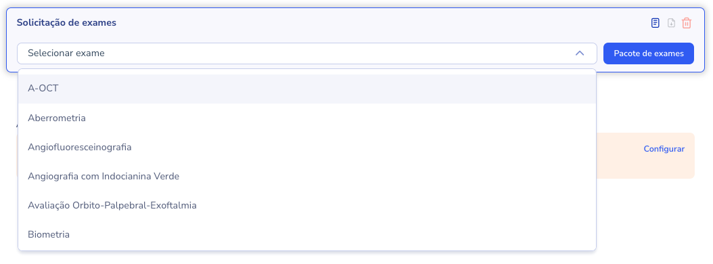
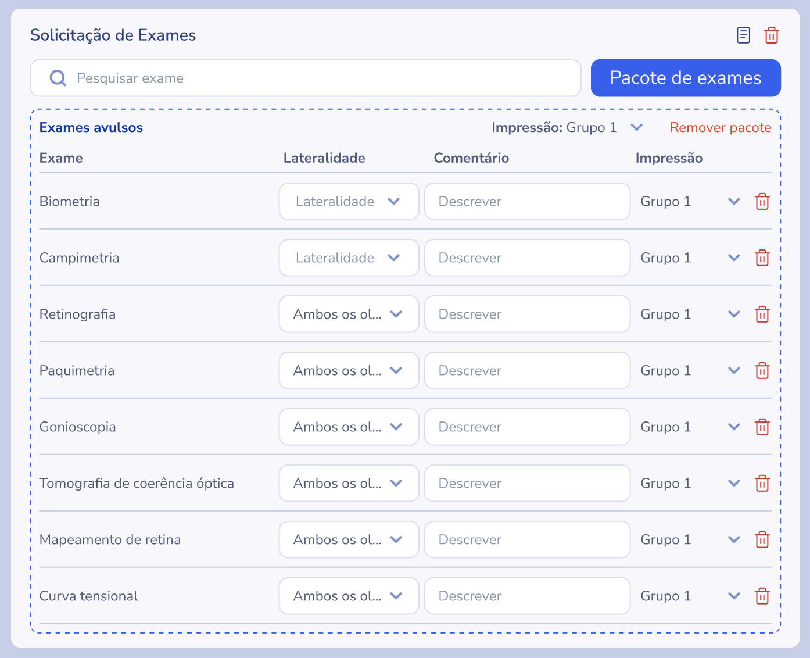
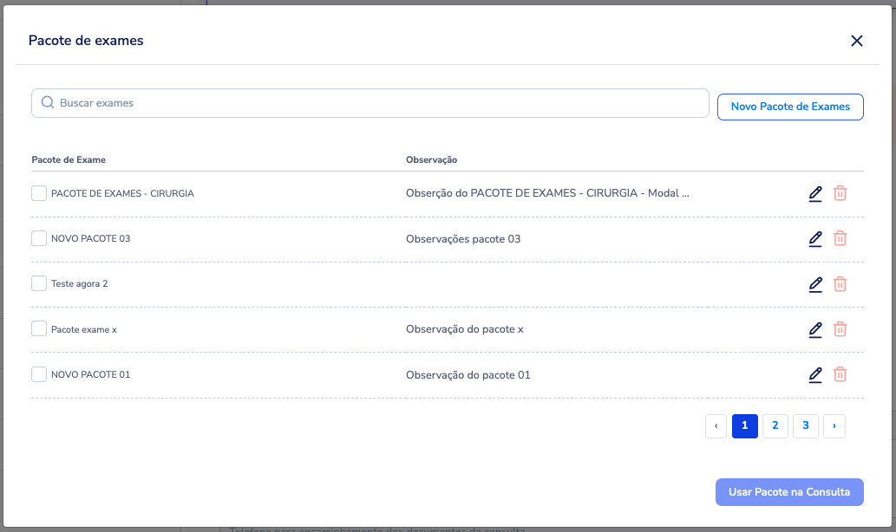
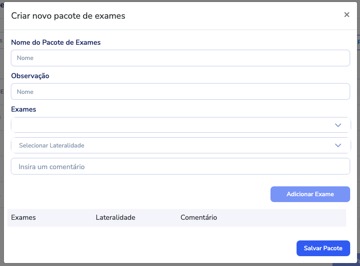
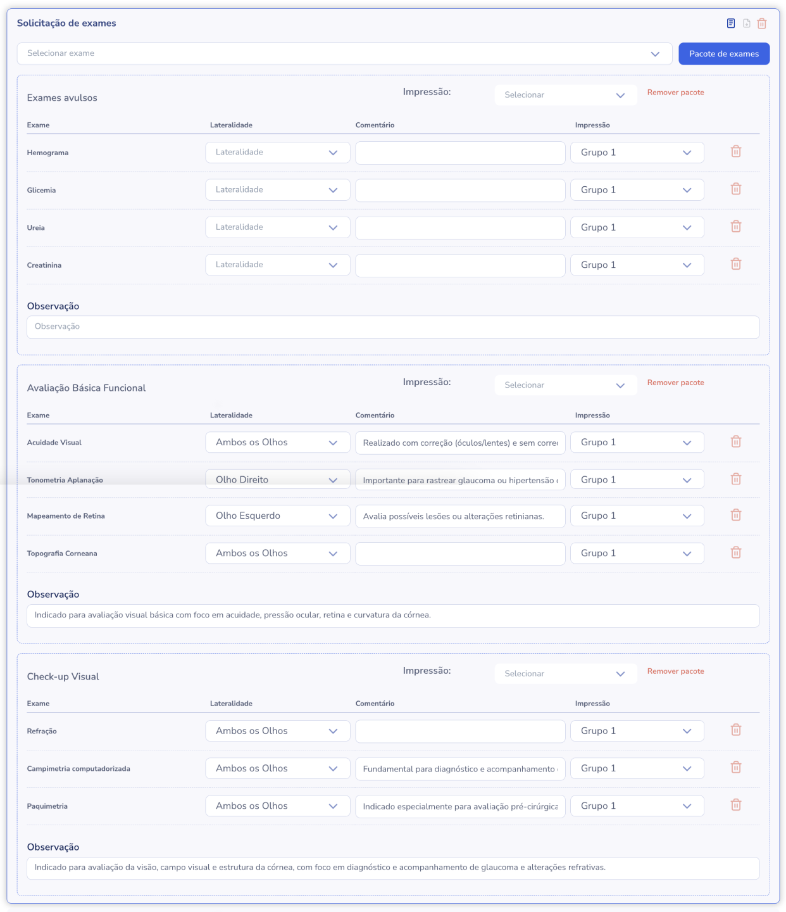
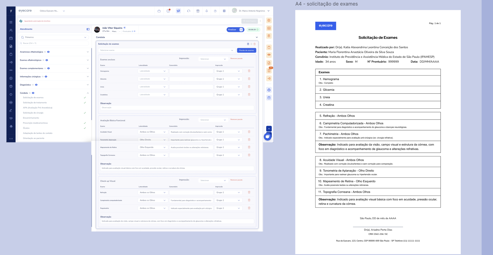
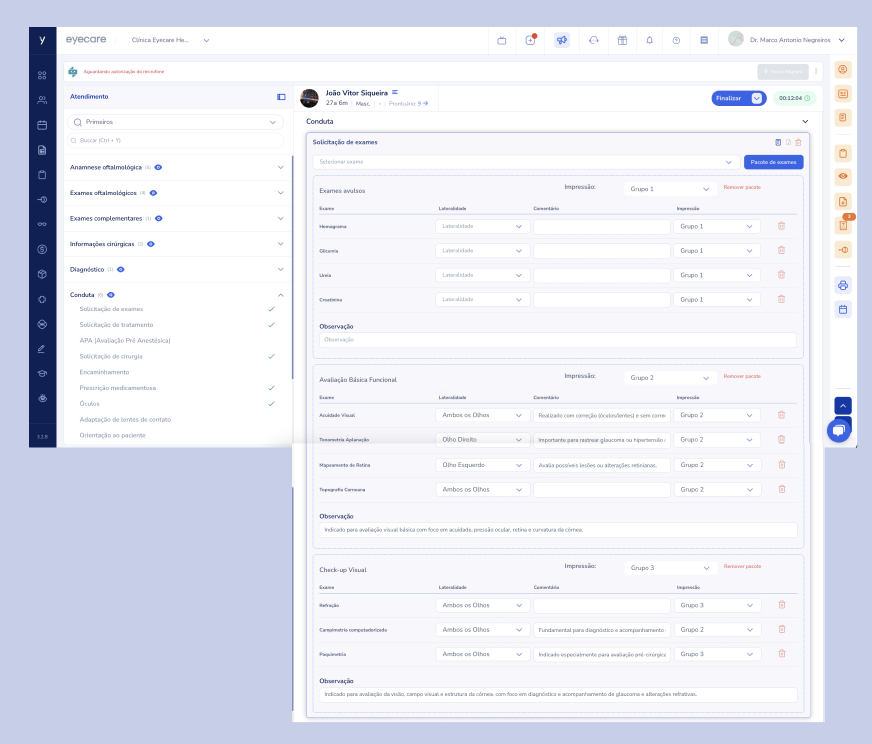
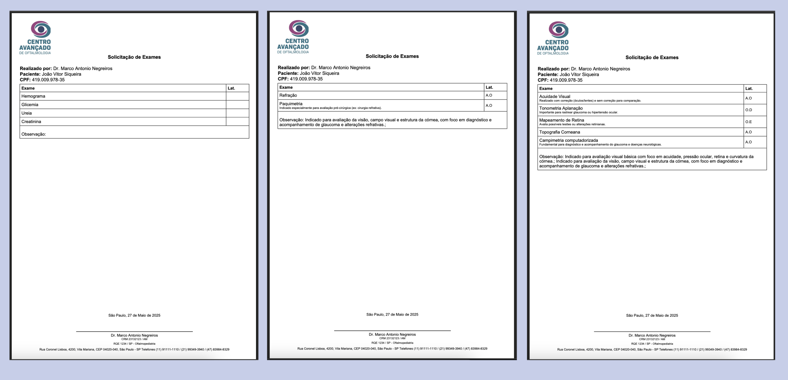

# Teste prático de PHP/Vue para novos colaboradores


## Por onde começar

* Faça um clone deste projeto;
    ```bash
    git clone https://github.com/eyecarehealth/take-home-laravel-vue
    ```
* Crie uma nova branch com o seu nome ex:
    ```bash
    git checkout -b seunome
    ```
* Em sua branch adicione o projeto frontend em <a href="https://v2.vuejs.org/">VueJS 2</a> e o backend em <a href="https://laravel.com/docs/12.x">Laravel</a>
* Após a conclusão, crie um PR e na PR coloque todos os detalhamentos que achar necessário para explicar seu racional e caminhos escolhidos na solução do problema.

<br/><br/>


## Objetivo
O objetivo deste teste é avaliar suas habilidades em:
* PHP, Laravel, APIs;
* Design patterns;
* Padrões de projeto;
* MySQL e modelagem de dados;
* Conteinerização Docker;
* Testes unitários.


## Problema

### Solicitação de exames agrupados por páginas

A solicitação de exames é uma feature presente na consulta médica e têm como objetivo solicitar a realização de exames para um determinado paciente. Para facilitar os pedidos, criamos um conceito de pacote de exames que nada mais é do que um conjunto de exames agrupados para facilitar seu uso. Uma problemática existente é o fato de que em alguns casos os médicos precisam imprimir essas solicitações em páginas diferentes para que sejam encaminhados para laboratórios diferentes.

Em nosso sistema de teste vamos trabalhar com alguns objetos necessários para o seu funcionamento:

### Exame
Um exame é um pedito de exame a ser realizado por nosso paciente. Ele possui as seguintes propriedades:

<table>
    <tr>
        <td><b>Propriedade</b></td>
        <td><b>Tipo</b></td>
        <td><b>Obrigatório</b></td>
        <td><b>Descrição</b></td>
    </tr>
    <tr>
        <td>name</td>
        <td>string</td>
        <td>Sim</td>
        <td>Nome do exame</td>
    </tr>
    <tr>
        <td>laterality</td>
        <td>enum('OD', 'OE', 'AO')</td>
        <td>Não</td>
        <td>Lateralidade do exame: OD - Olho direito, OE - Olho esquerdo, AO - Ambos os olhos</td>
    </tr>
    <tr>
        <td>comment</td>
        <td>string</td>
        <td>Sim</td>
        <td>Comentário ou observação para o exame</td>
    </tr>
    <tr>
        <td>group</td>
        <td>enum('Individual', 'Grupo 1', 'Grupo 2', 'Grupo 3', 'Grupo 4', 'Grupo 5')</td>
        <td>Sim</td>
        <td>Definição de impressão, se refere a em qual página esse exame deve ser impresso</td>
    </tr>
</table>

<br/><br/>

### Pacote
Um pacote se trata de um agrupamento de exames previamente cadastrados. Ele possui as seguintes propriedades:

<table>
    <tr>
        <td><b>Propriedade</b></td>
        <td><b>Tipo</b></td>
        <td><b>Obrigatório</b></td>
        <td><b>Descrição</b></td>
    </tr>
    <tr>
        <td>name</td>
        <td>string</td>
        <td>Sim</td>
        <td>Nome do pacote</td>
    </tr>
    <tr>
        <td>observations</td>
        <td>string</td>
        <td>Não</td>
        <td>Orientações referentes ao pacote</td>
    </tr>
    <tr>
        <td>exams</td>
        <td>array</td>
        <td>Sim</td>
        <td>Conjunto de exames agrupados no pacote</td>
    </tr>
</table>

<br/><br/>


A seleção avulsa de exames gera um pacote chamado "Exames avulsos"
<br/>
<p align="center" id="top">
    
</p>


Nossa tela base tera a seguinte aparência, e neste exemplo já temos alguns exames selecionados de forma avulsa
<br/>
<p align="center" id="top">
    
</p>

<br/><br/>

## Seleção de pacotes

Modal que seja capaz de listar o pacotes já criados, este modal será aberto ao clicar em "Pacote de exames"
<br/>
<p align="center" id="top">
    
</p>
<br/><br/>

## Criação de um pacote

Em nossa aplicação WEB vamos precisar criar um modal para criação dos pacotes e inclusão dos exames, este modal será aberto ao clicar em "Novo pacote de Exames"

<p align="center" id="top">
    
</p>
<br/><br/>

## Resultado final após selecionar múltiplos pacotes

Após a inserção de exames avulsos ou pacotes, teremos o seguindo resultado
<br/>

<p align="center" id="top">
    
</p>
<br/><br/>


### Impressão dos documentos

Caso os exames estejam todos inseridos no mesmo grupo será gerado apenas um PDF com uma divisão por grupos como no exemplo abaixo:

<p align="center" id="top">
    
</p>
<br/><br/>

Já no caso de conter múltiplos grupos o PDF deve respeitar essa divisão mantendo o conceito de pacotes, mas separando por páginas

<p align="center" id="top">
    
</p>
<br/><br/>

<p align="center" id="top">
    
</p>
<br/><br/>


## Informações importantes
Não preocupe em criar os dados de paciente e médico, você mockar esses dados para o teste


## Requisitos

* Ser possível cadastrar exames
* Ser possível cadastrar pacotes
* Ser possível adicionar exames e pacotes a uma lista
* Ser possível imprimir PDF de acordo com a lógica sugerida
* Arquivos de migração construindo as tabelas necessárias
* Design pattern aplicados à lógica
* Rotas de API para as ações do sistema

